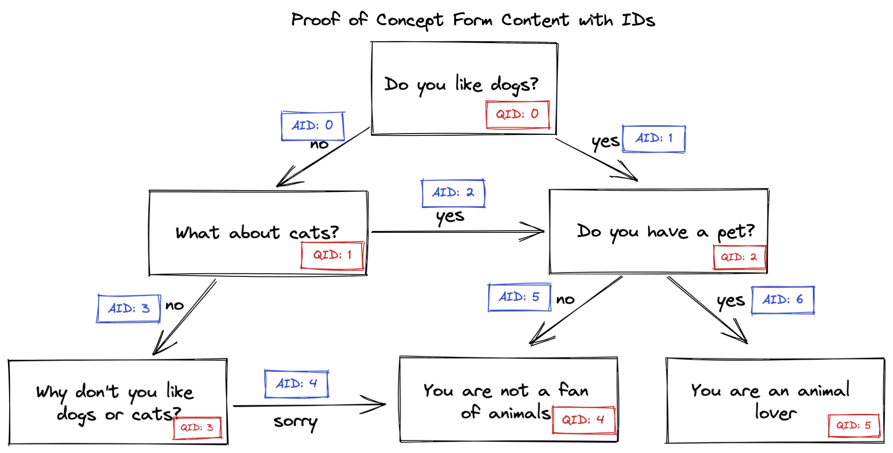
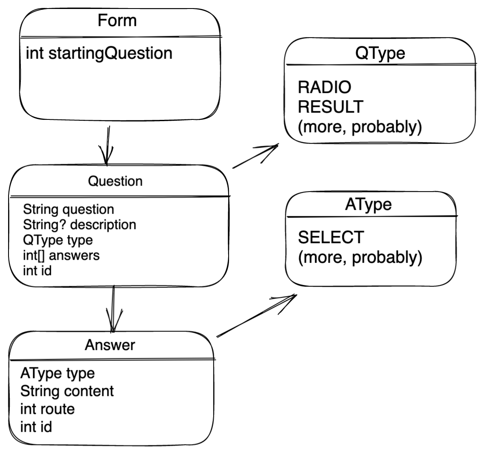

# Dynamically navigated multi-page form: proof of concept

## Discussed in standup on Nov 9

Question types:

- Radio
- Next
- Next with input
- End (this represents end states that recommend calling the hotline)
- End with summary

Things to edit in the data structures/models:

- Add an "Additional Info" (blurb) constants JSON
- Add references to those IDs in the answers model/JSON

## Overview

This branch is not intended to be merged to master, but rather serve as a reference resource to start our work on.The example shown on this branch is a simple form who's path can be seen below:

The example can be seen at localhost:3000/DynamicPOC. This proof of concept replaces the brute force solution of having a different Next.js page for each literal question with a solution that has a different page for each different form, and question/answer components get replaced on that page as the user progresses through the form.

## Rough baseline data design

The general idea is to keep all the form content in constant JSON files, and have the actual code select dynamically from them. Our need is for these constants to communicate to the web app rules for both routing to the next question and how to display the current question.

Below is a proposition and definitely not final starting state for what our design for our constants _could_ look like. It does _not_ take into consideration the actual questions on the form because I opened the document, got scared, and closed it again. Also this is a proof of concept so it's not that deep.

Also I KNOW that the arrows definitely don't match UML whatever but okay it's fine

## Project structure

The project structure in this current directory (`DynamicPOC`) mimics what our project root could look like (plus more probably).

- `components` for all components, including styled form components
- `constants` for all form specific text, routing, and display information
- `models` for all models of our constants so that we can translate between JSON and TS.

## Things to consider

- Logic for routing will likely get confusing if the form allows for a "select all that apply" situation. We can try to build data definitions that allow for as much flexibility as possible on this
- Any answer that has an open text input will need to be specially addressed regarding which callback is used to store the answer
